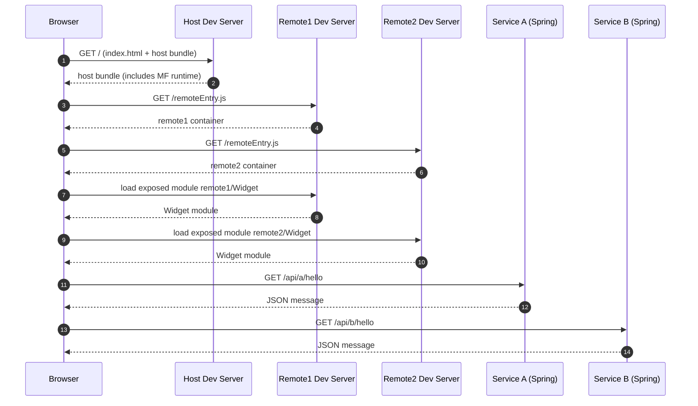

# Grozny Microfrontend POC

Learning showcase: React microfrontends with Webpack Module Federation + Spring Boot microservices.

## Structure
- `frontend/host` - shell/host app
- `frontend/remote1` - federated module A
- `frontend/remote2` - federated module B
- `backend/service-a` - REST API for Remote A
- `backend/service-b` - REST API for Remote B

## Run (dev)
### Frontend
1. One-time install:
   - `npm run install:all`
2. Start all MFEs:
   - `npm run dev`
3. Open `http://localhost:3000`

### Backend
1. In two terminals:
   - `cd backend/service-a` then `../..\\gradlew.bat bootRun` (Windows)
   - `cd backend/service-b` then `../..\\gradlew.bat bootRun` (Windows)
2. APIs:
   - `http://localhost:8081/api/a/hello`
   - `http://localhost:8082/api/b/hello`

### One command (frontend + backend)
1. `npm run dev:all`

### Windows-friendly (frontend + backend)
1. `npm run dev:all:win`

### Stop all dev servers
1. `npm run stop`

## Notes
- This POC keeps things intentionally small and explicit for learning.
- CORS is enabled in both services for local development.

## How It Works (Technical Overview)
This POC uses Webpack Module Federation to load independently built React apps (remotes) into a host at runtime.

Key ideas:
- Each remote builds its own bundle and exposes a module via `ModuleFederationPlugin`.
- The host does not bundle remote code at build time. It loads it at runtime from each remote’s `remoteEntry.js`.
- Shared deps (`react`, `react-dom`) are configured as singletons to avoid duplicate React copies.
- The host uses `React.lazy()` + `Suspense` to load remote modules asynchronously.
- Each remote calls its own Spring Boot service via REST.

Runtime flow:
- Start the remotes; each serves `remoteEntry.js` on its dev server.
- Start the host; it references the remotes via URLs in `webpack.config.js`.
- When the host renders a remote component, Webpack fetches the remote container and executes the exposed module.
- The remote component fetches data from its backend service.

### Sequence Diagram (Bootstrap + Runtime Load)

