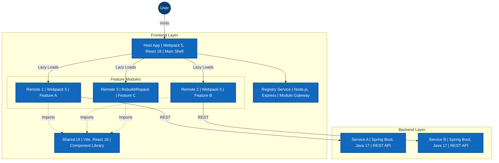
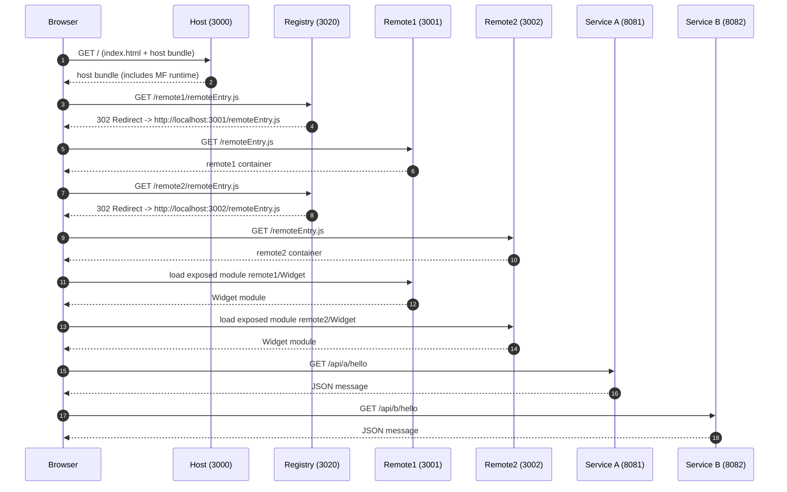

# MicroFrontend Showcase

React microfrontends with Webpack / Vite / RsbuildModule Federation + Spring Boot microservices.

> **⚠️ Alert**: **Remote 3** uses **Rsbuild (Rspack)** which is currently in an **Alpha/Beta** integration phase. APIs and plugin compatibility for this specific remote are subject to change. The Host, Registry, and other Remotes use stable Webpack 5 or Vite.

## Structure

- `frontend/host` - **Webpack 5** shell/host app (Port 3000)
- `frontend/registry` - **Express** module federation gateway (Port 3020)
- `frontend/remote1` - **Webpack 5** federated module A (Port 3001)
- `frontend/remote2` - **Webpack 5** federated module B (Port 3002)
- `frontend/remote3` - **Rsbuild (Rspack)** federated module C (Port 3003)
- `frontend/shared-ui` - **Vite** shared ui library (Port 3011)
- `backend/service-a` - REST API for Remote A (Port 8081)
- `backend/service-b` - REST API for Remote B (Port 8082)

## Run (dev)

### Frontend

1. One-time install:
   - `npm run install:all`
2. Start all MFEs (Host, Remotes, Registry) and Backend Services:
   - `npm run dev:all`
   - On Windows: `npm run dev:all:win`
3. Open `http://localhost:3000`

### Backend

1. In two terminals:
   - `cd backend/service-a` then `../..\\gradlew.bat bootRun` (Windows)
   - `cd backend/service-b` then `../..\\gradlew.bat bootRun` (Windows)
2. APIs:
   - `http://localhost:8081/api/a/hello`
   - `http://localhost:8082/api/b/hello`

### One command (frontend + backend)

1. `npm run dev:all`

### Windows-friendly (frontend + backend)

1. `npm run dev:all:win`

### Stop all dev servers

1. `npm run stop`

## Notes

- This POC keeps things intentionally small and explicit for learning.
- CORS is enabled in both services for local development.

## 🛠️ Mixed Bundler Ecosystem

This project demonstrates a powerful capability of Module Federation: **Interoperability between different build tools.**

We successfully mix **Webpack**, **Vite**, and **Rsbuild (Rspack)** in a single federated application:

| App | Role | Bundler | Tech Stack |
| :--- | :--- | :--- | :--- |
| **Host** | Shell/Consumer | **Webpack 5** | React 18 |
| **Remote 1** | Feature A | **Webpack 5** | React 18 |
| **Remote 2** | Feature B | **Webpack 5** | React 18 |
| **Remote 3** | Feature C | **Rsbuild (Rspack)** | React 18, TypeScript |
| **Shared UI** | Component Lib | **Vite** | React 18 |

### Integration Details

- **Webpack Hosts** consume **Rsbuild** and **Vite** remotes using `promise new Promise(...)` dynamic imports or standard MF 2.0 loading logic.
- **Rsbuild (Rspack)** provides extremely fast builds while maintaining compatibility.
- **Micro-Frontends** allows teams to choose their preferred tools without locking the entire architecture to one bundler.

## How It Works (Technical Overview)

This POC uses Webpack Module Federation to load independently built React apps (remotes) into a host at runtime.

Key ideas:

- Each remote builds its own bundle and exposes a module via `ModuleFederationPlugin`.
- The host does not bundle remote code at build time. It loads it at runtime from each remote’s `remoteEntry.js`.
- Shared deps (`react`, `react-dom`) are configured as singletons to avoid duplicate React copies.
- The host uses `React.lazy()` + `Suspense` to load remote modules asynchronously.
- Each remote calls its own Spring Boot service via REST.

Runtime flow:

- Start the remotes; each serves `remoteEntry.js` on its dev server.
- Start the registry; it listens for requests and holds the mapping of `scope -> url` (Port 3020).
- Start the host; it references the remotes via the Registry URL (e.g., `localhost:3020/remote1/...`).
- When the host renders a remote component, Webpack requests the script from the Registry.
- The Registry responds with a `302 Found` redirect to the actual Remote URL.
- The browser fetches the remote container from the redirected URL and executes the exposed module.
- The remote component fetches data from its backend service.

## System Architecture

The following graph illustrates the container architecture, highlighting the technology stack for each module and their communication patterns (C4 Container View style).



### Sequence Diagram (Bootstrap + Runtime Load)



## Module Federation Registry (Control Plane)

This project includes a **Control Plane** (Registry) for a Micro-Frontend architecture. It serves as a centralized gateway that dynamically resolves the location of remote modules.

Instead of hardcoding remote URLs in the Host application, the Host points to this Registry. The Registry then redirects the request to the correct version or location of the remote.

### How It Works

1. **Request**: The Host application requests a remote entry file from the Registry (e.g., `http://localhost:3020/remote1/remoteEntry.js`).
2. **Resolution**: The Registry looks up its configuration (`frontend/registry/config.json`) to determine the current active URL for `remote1` (e.g., `http://localhost:3001/remoteEntry.js`).
3. **Redirect**: The Registry responds with a `302 Found` redirect, sending the browser to the actual location.

### Benefits

#### 🚀 Dynamic Traffic Control

You can change where a remote points to **without redeploying the Host**. This enables powerful deployment strategies:

- **Canary Releases**: Direct 10% of traffic to a new version of a remote.
- **A/B Testing**: Serve different versions of a feature to different user segments.
- **Blue/Green Deployment**: Instantly switch all traffic to a new deployment.

#### 🛡️ Immediate Rollbacks

If a new version of a remote introduces a critical bug, you can revert to the previous version instantly by updating the Registry configuration. No need to rollback or rebuild the Host application.

#### 📦 Version Management

The Host application remains decoupled from specific versions. It always asks for "remote1", and the Control Plane decides whether that translates to `v1.0.0`, `v1.1.0`, or a `beta` build.

### Configuration

The mapping is defined in `frontend/registry/config.json`:

```json
{
  "remote1": "http://localhost:3001/remoteEntry.js",
  "remote2": "http://localhost:3002/remoteEntry.js",
  "remote3": "http://localhost:3003/remoteEntry.js",
  "sharedUI": "http://localhost:3011/remoteEntry.js"
}
```

## Shared UI Library (Vite Integration)

Added a `shared-ui` package (`frontend/shared-ui`) which demonstrates **mixing build tools** (Webpack + Vite) in a single Module Federation architecture.

- **Stack**: React + Vite + `@originjs/vite-plugin-federation`.
- **Purpose**: Exposes reusable components (e.g., `SharedButton`) to other remotes.
- **Port**: 3011 (Preview mode).

### Key Technical Details

1. **Vite vs Webpack**:
    - `shared-ui` uses Vite for lightning-fast development.
    - Other apps (Host, Remote1, Remote2) use Webpack 5.
    - We use `@originjs/vite-plugin-federation` to make Vite output compatible with Webpack's Module Federation.

2. **Promise-based Loading**:
    - Since Vite outputs **ESM** (ECMAScript Modules) and Webpack remotes typically expect `var` global injection (MF v1), consuming a Vite remote in Webpack requires a **Promise-based import**:

      ```javascript
      // webpack.config.js in Remote1
      remotes: {
        sharedUI: `promise new Promise(resolve => {
          import("http://localhost:3020/sharedUI/remoteEntry.js").then(remote => {
            resolve(remote)
          })
        })`
      }
      ```

3. **Registry Integration**:
    - The `shared-ui` is also routed through the **Registry Gateway** (port 3020).
    - `remote1` requests `http://localhost:3020/sharedUI/remoteEntry.js` -> redirects to `http://localhost:3011/assets/remoteEntry.js`.
